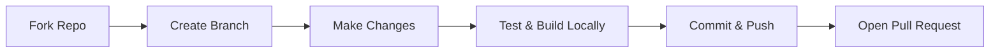

# Contributing to SnapFlix 🎬

Thank you for your interest in contributing to **SnapFlix**! We welcome contributions from developers of all skill levels. Whether you are fixing bugs, optimizing UI/UX responsiveness, enhancing video player features, or improving documentation, your help is appreciated.

---

## 📋 Table of Contents

- [Code of Conduct](#code-of-conduct)
- [How Can I Contribute?](#how-can-i-contribute)
- [Development Setup](#development-setup)
- [Contribution Workflow](#contribution-workflow)
- [Commit Guidelines](#commit-guidelines)
- [Pull Request Checklist](#pull-request-checklist)
- [Need Help?](#need-help)

---

## 🤝 Code of Conduct

We are committed to providing a welcoming, inclusive, and harassment-free environment for everyone. Please treat all contributors, maintainers, and community members with kindness and respect.

---

## 💡 How Can I Contribute?

You can contribute in many ways:

- **🐛 Bug Fixes**: Report or fix bugs related to playback, route synchronization, or UI alignment.
- **✨ Features**: Implement requested features such as enhanced watch history, player gestures, or custom lists.
- **📱 Responsiveness**: Improve mobile, tablet, and TV layouts across screen sizes and orientations.
- **⚡ Performance**: Optimize bundle sizes, image loading, and stream proxy response times.
- **📖 Documentation**: Improve setup guides, code comments, and project documentation.

---

## 🛠️ Development Setup

### Prerequisites

Ensure you have the following installed on your machine:
- **Node.js** (v18.18.0 or higher recommended)
- **npm**, **pnpm**, or **yarn**
- **Git**

### Installation

1. **Fork the Repository**:  
   Click the **Fork** button at the top right of the [SnapFlix Repository](https://github.com/farhanansari888/SnapFlix) to create your own copy.

2. **Clone your fork**:
   ```bash
   git clone https://github.com/<your-username>/SnapFlix.git
   cd SnapFlix
   ```

3. **Install dependencies**:
   ```bash
   npm install
   ```

4. **Setup Environment Variables**:  
   Copy the example environment file:
   ```bash
   cp .env.local.example .env.local
   ```
   Add your TMDB API Key and Supabase credentials in `.env.local`:
   ```env
   NEXT_PUBLIC_TMDB_API_KEY=your_tmdb_api_key_here
   NEXT_PUBLIC_SUPABASE_URL=your_supabase_url_here
   NEXT_PUBLIC_SUPABASE_ANON_KEY=your_supabase_anon_key_here
   ```

5. **Run the local development server**:
   ```bash
   npm run dev
   ```
   Open [http://localhost:3000](http://localhost:3000) in your browser.

---

## 🔄 Contribution Workflow

Follow this step-by-step process to submit your changes:



1. **Keep your fork up-to-date**:
   ```bash
   git remote add upstream https://github.com/farhanansari888/SnapFlix.git
   git checkout main
   git pull upstream main
   ```

2. **Create a new branch**:  
   Always create a dedicated feature or bugfix branch:
   ```bash
   # For new features
   git checkout -b feat/your-feature-name

   # For bug fixes
   git checkout -b fix/issue-description
   ```

3. **Make your changes**:  
   - Follow existing code patterns and conventions.
   - Use TypeScript types properly (avoid unnecessary `any`).
   - Use Tailwind CSS tokens and utilities defined in `src/styles/globals.css`.

4. **Verify your build locally**:  
   Before committing, always make sure the Next.js production build passes with zero errors:
   ```bash
   npm run build
   ```

5. **Commit and Push**:
   ```bash
   git add -A
   git commit -m "feat(player): add double-tap gesture to toggle zoom"
   git push origin feat/your-feature-name
   ```

6. **Submit a Pull Request (PR)**:
   - Go to your fork on GitHub.
   - Click **Compare & pull request**.
   - Provide a clear title and description explaining what changed and why.
   - Reference any related issues (e.g., `Fixes #12`).

---

## 📝 Commit Guidelines

We recommend following the [Conventional Commits](https://www.conventionalcommits.org/) format:

| Prefix | Usage | Example |
| :--- | :--- | :--- |
| `feat:` | A new feature | `feat(player): add cinema mode on desktop` |
| `fix:` | A bug fix | `fix(stream): filter out preview thumbnail tiles` |
| `docs:` | Documentation changes | `docs: update contributing guidelines` |
| `style:` | Code style / formatting (no logic change) | `style: format imports and clean whitespace` |
| `refactor:` | Code restructuring without feature change | `refactor: simplify watch route sync hook` |
| `perf:` | Performance improvements | `perf: lazy load recommendation carousels` |

---

## ✅ Pull Request Checklist

Before submitting your PR, make sure:
- [ ] Code compiles cleanly with `npm run build`.
- [ ] No extraneous console logs, debuggers, or leftover test files.
- [ ] The app is responsive on mobile, tablet, and desktop screens.
- [ ] Meaningful and concise commit messages.
- [ ] The PR description clearly explains the changes.

---

## 💬 Need Help?

If you have questions, run into issues, or want to discuss a new idea before writing code:
- Open an [Issue on GitHub](https://github.com/farhanansari888/SnapFlix/issues)
- Reach out to the maintainers

Happy streaming & coding! 🍿🚀
